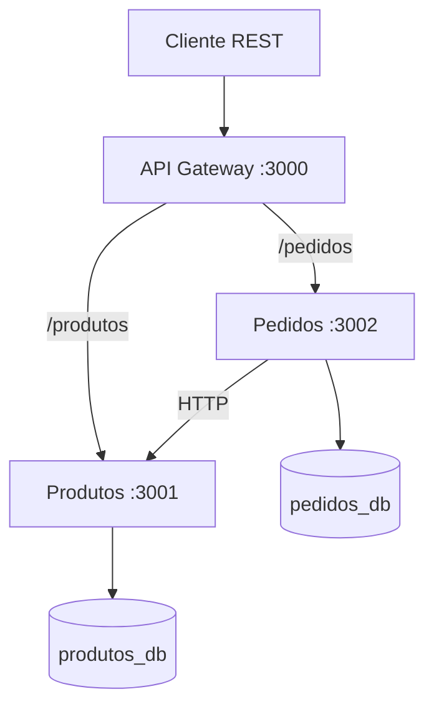

# Microserviços com Node.js

Projeto didático com dois microserviços em Node.js, persistência em PostgreSQL e uma entrada única por API Gateway.

## Arquitetura



## Estrutura

```text
microservicos/
├── gateway/
├── produtos/
├── pedidos/
├── banco/
│   └── init.sql
├── docker-compose.yml
└── README.md
```

## Tecnologias

- Node.js;
- Express;
- Axios;
- PostgreSQL;
- Docker e Docker Compose.

## Executar

Com o Docker Desktop iniciado, execute na raiz do projeto:

```bash
docker compose up --build
```

Para encerrar:

```bash
docker compose down
```

Para apagar também os volumes e recriar os bancos:

```bash
docker compose down -v
```

## Endereços

| Serviço | Endereço |
| --- | --- |
| API Gateway | `http://localhost:3000` |
| Produtos | `http://localhost:3001` |
| Pedidos | `http://localhost:3002` |
| PostgreSQL | `localhost:5432` |

O acesso principal deve ser realizado pelo API Gateway, na porta `3000`.

## Requisições

### Criar produto

```http
POST http://localhost:3000/produtos
Content-Type: application/json

{
  "nome": "Teclado",
  "preco": 150
}
```

### Listar produtos

```http
GET http://localhost:3000/produtos
```

### Buscar produto

```http
GET http://localhost:3000/produtos/1
```

### Criar pedido

```http
POST http://localhost:3000/pedidos
Content-Type: application/json

{
  "produtoId": 1,
  "quantidade": 2
}
```

### Listar pedidos

```http
GET http://localhost:3000/pedidos
```

### Buscar pedido

```http
GET http://localhost:3000/pedidos/1
```

## Bancos de dados

Os dois microserviços utilizam bancos separados na mesma instância PostgreSQL:

- `produtos_db`: dados do serviço de Produtos;
- `pedidos_db`: dados do serviço de Pedidos.

O campo `produto_id` armazenado em Pedidos é uma referência lógica. Não existe chave estrangeira entre os dois bancos.
